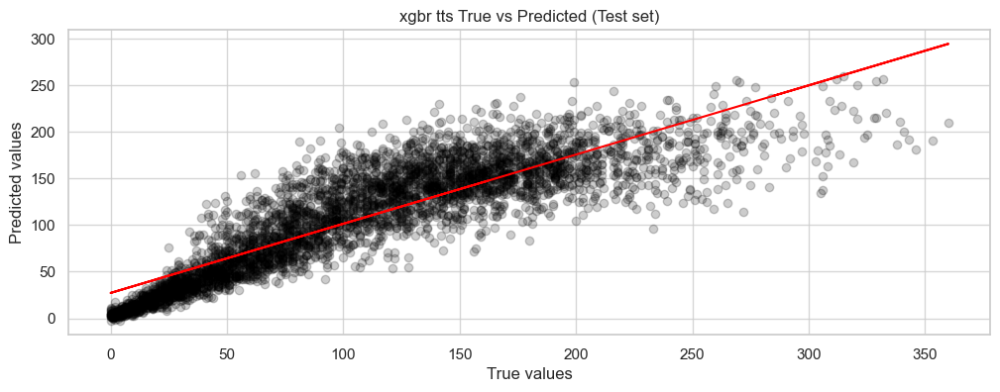

[]()
[]()
[]()
[]()
[]()


# Overview
In this project, we work on a *exploratory data analysys* of the dataset for create a predictive maintenance system for a turbojet engine. We use such tools to help us get better insights from our data and try to model a system that can predict when a turbojet engine will need to be maintained.

Since the data is mock data, even the train data is not real, the results may be not really accurate. The original docummentation threat this as a *experimental scenario*.

The goal is not necessary get the real RUL of the engine but and aproximation of it so the technician can make a decision based on it.


## Dataset

The dataset for this task is the FD001 dataset, the first dataset of the project wich consist on 100 different engines and a variety of cycles for each engine. 

FD001 is the simplest and easiest one were only HPC degration is present at SEA LEVEL, wich is the principal factor of the RUL in this dataset. We got others like FD002, FD003 and FD004, which are more complex and have more factors to consider. We don't work with them in this project.

The dataset can be found >> [here](https://www.kaggle.com/datasets/behrad3d/nasa-cmaps/data).


## Project Description

Hence FD001 is the simplest, it came very clean and ready to use. Depending on how we go through the modeling phase, we can treat the data more or less in order to get a good baseline model. 

We use tree-based models, so we don't normalize outliers.

The models used were: 

- Random Forest
- XGBoost
- KNN
- Linear Regression
- Ridge Regression
- Lasso Regression
- Support Vector Regression

At the end, we use XGBRegressor as our final model with handmade tuning.

# Key Learning Points

## Mock Data

Since is the first time I work on mock data, I needed to learn not how to handle it but also how to deal with the noise generated by the test set they delivered to us.

To make it more difficult, the sensor measure of the test set is not the same as the train set, is much more noisy so is hard for the model to generalize.

## Hyperparameter

Tuning the model requires a good understanding of the metrics and the math behind it, even more when we hand-tune the model. Choosing the right answer can improve a 1%, and it is much appreciated isntead of just putting random values and trying to figure if the model will improve or not.


# Results



| Metric | Train Set | Test Set |
|--------|-----------|----------|
| **MAE** | 16.85 | 23.57 |
| **RMSE** | 24.20 | 33.97 |
| **MSE** | 585.47 | 1153.87 |
| **R²** | 0.876 | 0.763 |

# Project Structure

```bash
Project06_final_proj.../
├── app/                  # streamlit app
├── data/                 # project data
│   ├── 01_raw/           # raw data (on txt)
│   └── 02_processed/     # processed data (on csv)
├── models/               # models created
├── notebooks/            # notebooks (.ipynb)
├── src/                  # visuals
├── .gitignore            # file to ignore files in Git
├── LOG                   # file of logs (es-en)
└── README.md             # main documentation of the project
```

## Installation & Usage
```bash
# Clone repository
git clone https://github.com/iKebb/Engine-Predictive-Maintenance-System.git
```

```python
# To run the Streamlit app
streamlit run app/app.py
```

## Contributors

<table align="center">
  <tr>
    <td align="center">
      <a href="https://github.com/iKebb">
        <br>
        <sub><b>Keberth</b></sub>
      </a>
    </td>
</table>

## License

This project is free of license. Feel free to use it!

## Contact

- **Via E-mail** - [keberth12@gmail.com](mailto:keberth12@gmail.com)
- **Via LinkedIn** - [Keberth José Rodríguez Albino](https://www.linkedin.com/in/keberth-josera-vkse1666)

Repo link: https://github.com/iKebb/Engine-Predictive-Maintenance-System